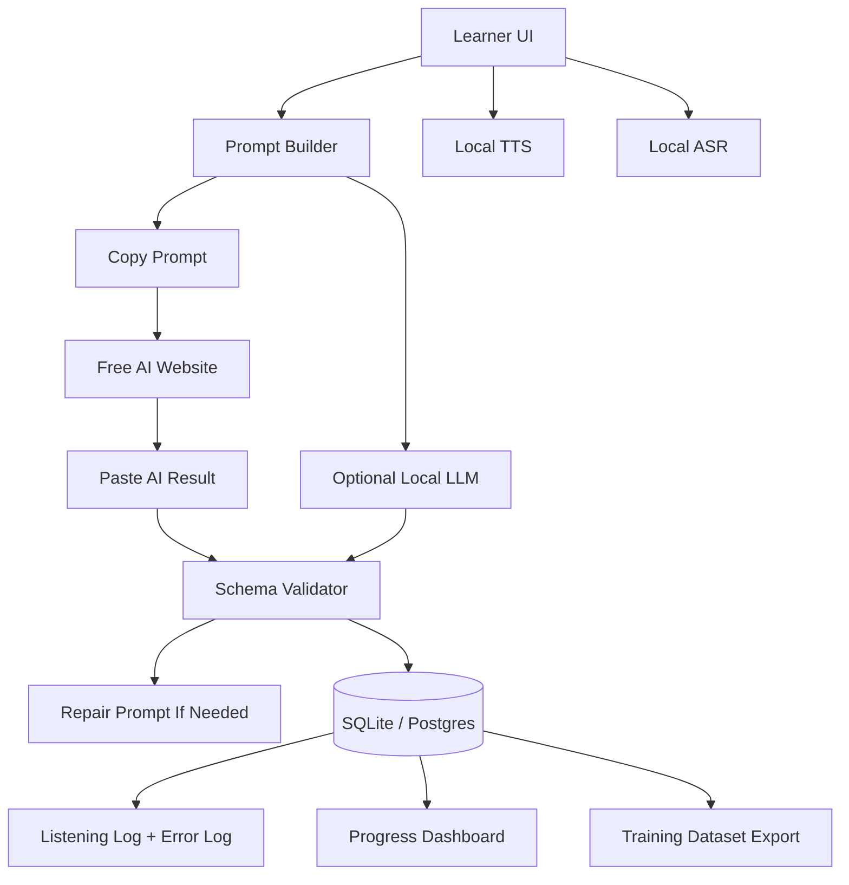

# Budget-Constrained AI Language Practice Architecture

Date: 2026-07-04

## Goal

Build the personal AI language practice system under tight budget constraints by making AI execution pluggable:

1. Manual free-AI relay for the cheapest MVP.
2. Local open models for private/offline generation and fine-tuned behavior.
3. Paid APIs only as optional fallback for hard cases or premium use.

The app should remain the source of truth for workflow, logs, validation, rubrics, and retry drills. External AI websites or local models should only produce structured outputs that the app can validate and store.

## Product Constraint From The Listening Spec

The learning flow should remain:

```text
topic
-> real situation
-> listening input
-> listening checks
-> chunk mining
-> roleplay
-> writing
-> rubric feedback
-> listening log + error log
-> retry drills
-> progress measurement
```

Listening stays before roleplay because it gives the learner contextual input before speaking and writing.

## Recommended Low-Cost Architecture



## Three AI Execution Modes

### Mode A: Manual Free-AI Relay

Use this first.

1. Learner chooses topic, CEFR level, situation, target skill, and native language.
2. App generates a strict prompt.
3. Learner copies prompt into ChatGPT Free, Gemini Free, Claude Free, Qwen Chat, DeepSeek, or another available website.
4. AI returns JSON.
5. Learner pastes JSON back into the app.
6. App validates and stores the lesson pack.

This avoids API cost while preserving the app's data layer. Do not automate free websites unless their terms explicitly allow automation.

### Mode B: Local Open Model

Use this when quality is acceptable and the machine can run a model locally.

Options:

- Ollama for easy local inference.
- LM Studio for a local OpenAI-compatible server.
- llama.cpp for lightweight deployment.
- vLLM for higher-throughput server deployment.

Good local model targets:

- Qwen 3.x / Qwen 3.5 4B-8B for JSON lesson generation.
- Mistral / Ministral 3B-8B for compact generation.
- Gemma 4B-9B if licensing and language quality fit.
- gpt-oss 20B if hardware permits.

### Mode C: Paid API Fallback

Use paid APIs only for:

- hard lessons that local/free models fail
- batch generation for teacher mode
- premium users
- evaluation set creation
- difficult feedback requiring stronger reasoning

Paid APIs should be behind a feature flag, never required for the core MVP.

## JSON Contract: Lesson Pack

Every AI backend must return this shape.

```json
{
  "schema_version": "lesson_pack.v1",
  "topic": "Reschedule a meeting",
  "target_language": "English",
  "learner_native_language": "Vietnamese",
  "cefr_level": "B1",
  "situation": "A workplace meeting must be moved because of a scheduling conflict.",
  "pre_listening": {
    "context_brief": "",
    "prediction_questions": [],
    "key_phrases_to_notice": []
  },
  "listening_input": {
    "script": "",
    "recommended_voice": "neutral workplace conversation",
    "accent": "General American or British",
    "speed": "B1 natural-slow",
    "duration_seconds": 75
  },
  "while_listening": {
    "gist_questions": [],
    "detail_questions": [],
    "key_phrase_recognition": []
  },
  "post_listening": {
    "chunks": [],
    "shadowing_lines": [],
    "listening_to_speaking_bridge": []
  },
  "roleplay": {
    "learner_role": "",
    "ai_role": "",
    "turns": []
  },
  "writing_task": {
    "task": "",
    "constraints": [],
    "target_chunks_to_use": []
  },
  "rubric": {
    "listening": [],
    "speaking": [],
    "writing": []
  },
  "retry_drills": [],
  "quality_checks": {
    "level_is_cefr_appropriate": true,
    "uses_target_chunks": true,
    "no_answer_leak_before_listening": true
  }
}
```

## Prompt Template: Generate Lesson Pack

```text
You are generating a structured lesson pack for a personal AI language practice system.

Return ONLY valid JSON. Do not use markdown. Do not add comments.

Task:
- Target language: {{target_language}}
- Learner native language: {{native_language}}
- CEFR level: {{cefr_level}}
- Topic: {{topic}}
- Situation: {{situation}}
- Session length: {{session_minutes}} minutes

Pedagogy:
- Use task-based, context-based learning.
- Listening must come before roleplay.
- Follow pre-listening, while-listening, post-listening.
- The listening input should be short, realistic, and reusable for speaking and writing.
- Do not reveal the full transcript before the listening checks.
- Include gist questions, detail questions, key phrase recognition, chunk mining, roleplay, writing, rubric, and retry drills.

Output schema:
{{lesson_pack_schema}}

Quality rules:
- Use natural language appropriate for {{cefr_level}}.
- Include 5-8 useful chunks.
- Make the listening script 60-90 seconds.
- Make the roleplay directly reuse the listening situation.
- Make the writing task continue the same situation.
- Keep feedback rubrics observable and easy to log.
```

## Prompt Template: Repair Invalid JSON

```text
Repair the following response into valid JSON matching the schema.

Rules:
- Return ONLY valid JSON.
- Preserve the useful content.
- Remove markdown fences and comments.
- Fill missing required fields with reasonable defaults.
- Do not invent a different lesson.

Schema:
{{lesson_pack_schema}}

Broken response:
{{broken_response}}
```

## Prompt Template: Feedback And Error Log

```text
You are evaluating a language learner's response.

Return ONLY valid JSON.

Context:
- Target language: {{target_language}}
- Native language: {{native_language}}
- CEFR level: {{cefr_level}}
- Topic: {{topic}}
- Listening script summary: {{listening_summary}}
- Target chunks: {{target_chunks}}

Learner attempt:
{{learner_attempt}}

Evaluate:
1. Listening comprehension if answers are included.
2. Speaking or writing quality.
3. Chunk reuse.
4. Errors worth logging.
5. One retry drill.

Output:
{
  "scores": {
    "gist": 0,
    "detail": 0,
    "chunk_recognition": 0,
    "response_readiness": 0,
    "output_transfer": 0
  },
  "error_log_items": [
    {
      "type": "grammar|vocabulary|naturalness|pronunciation|listening|tone|appropriateness",
      "evidence": "",
      "correction": "",
      "why_it_matters": "",
      "retry_priority": "low|medium|high"
    }
  ],
  "positive_notes": [],
  "retry_drill": {
    "instruction": "",
    "items": []
  }
}
```

## Data To Store For Future Fine-Tuning

Store raw and normalized data. Fine-tuning quality depends on preserving the original context.

Tables:

- `topics`: topic, CEFR level, situation, target language, native language.
- `lesson_packs`: prompt, AI output, validated JSON, source mode.
- `listening_inputs`: script, generated audio path, accent, speed, duration.
- `listening_attempts`: answers, replay count, score, missed detail.
- `chunks`: phrase, meaning, example, first source lesson.
- `roleplay_turns`: prompt, learner response, transcript, feedback.
- `writing_submissions`: draft, corrected version, rubric scores.
- `error_log`: error type, evidence, correction, retry priority.
- `retry_drills`: source error, generated drill, learner result.
- `model_outputs`: provider/model/site, prompt, response, accepted/rejected, reason.

Export datasets:

- `lesson_generation_sft.jsonl`
- `feedback_scoring_sft.jsonl`
- `error_classification.jsonl`
- `retry_generation_sft.jsonl`
- `json_repair_sft.jsonl`

## Fine-Tune Strategy

Do not fine-tune on day one. First collect enough real usage.

Minimum useful thresholds:

- 100 accepted lesson packs for format/style tuning.
- 300-500 feedback examples for error and rubric tuning.
- 1,000+ labeled errors for a reliable error classifier.
- 10+ hours of learner speech before considering ASR adaptation.

Recommended order:

1. Error classifier: cheapest and highest ROI.
2. JSON repair/normalizer: makes free AI relay more reliable.
3. Retry drill generator: turns data into practice.
4. Lesson pack generator: only after the schema is stable.
5. ASR fine-tuning: only if local Whisper/Parakeet errors are blocking progress.

## Model Shortlist

### Text Generation / Lesson Packs

Use LoRA or QLoRA.

| Model family | Best use | Notes |
| --- | --- | --- |
| Qwen 3.x / 3.5 4B-8B | JSON lesson generation, feedback, multilingual support | Best first fine-tune target. |
| Ministral / Mistral 3B-8B | Compact local generation | Good when hardware is limited. |
| Gemma 4B-9B | General instruction following | Check license and local quality. |
| gpt-oss 20B | Stronger local reasoning | Requires more hardware. |
| Llama 8B class | General instruction and feedback | Good ecosystem, may need more tuning for JSON. |

### Classification / Ranking

| Model type | Best use |
| --- | --- |
| ModernBERT / BGE / E5 small-base | Error category classification |
| Qwen small classifier | CEFR/task/error labels |
| LightGBM / logistic regression | Spaced repetition and retry priority |

### Embeddings

| Model | Use |
| --- | --- |
| BGE-M3 | multilingual retrieval |
| Qwen Embedding | semantic search over chunks/errors |
| E5-small/base | cheap local retrieval |

### Speech-To-Text

| Model | Use |
| --- | --- |
| Whisper large-v3-turbo | local multilingual ASR baseline |
| Whisper medium/small | lower hardware baseline |
| NVIDIA Parakeet | fast ASR where language support fits |

### Text-To-Speech

| Model | Use |
| --- | --- |
| Kokoro-82M | natural lightweight local TTS |
| Piper | very lightweight offline TTS |
| Coqui-style or other TTS stacks | only if voice control becomes important |

## What To Train From Scratch

Train from scratch only for small components:

- spaced repetition scheduler
- retry priority scorer
- error taxonomy classifier
- prompt router
- schema quality scorer

Avoid training these from scratch:

- general LLM tutor
- ASR foundation model
- TTS foundation model
- pronunciation assessment model

## MVP Build Plan

### Week 1

- Build a single-page prompt builder.
- Add copy prompt and paste JSON boxes.
- Validate JSON with the lesson schema.
- Store lesson packs in SQLite or Supabase.

### Week 2

- Add listening player and replay count.
- Generate TTS locally with Kokoro or Piper.
- Add gist/detail/key phrase answer form.
- Store listening attempts.

### Week 3

- Add roleplay and writing attempts.
- Add feedback prompt and pasted feedback JSON.
- Store error logs.

### Week 4

- Add retry drills.
- Add dashboard: completed topics, repeated errors, chunk reuse.
- Add dataset export as JSONL.

### Month 2+

- Add local LLM mode through LM Studio or Ollama.
- Add Whisper local transcription.
- Compare free AI relay vs local model outputs.

### Month 3+

- Fine-tune error classifier and JSON repair model.
- Fine-tune lesson generator if enough accepted examples exist.

## Cost Policy

Default:

```text
free relay first
-> local model second
-> paid API fallback last
```

Paid calls should be reserved for:

- creating gold-standard examples
- failed local/free outputs
- teacher/product workflows
- final quality review

## Research Anchors

- CEFR action-oriented approach: https://www.coe.int/en/web/common-european-framework-reference-languages/the-action-oriented-approach
- British Council listening lesson framework: https://www.teachingenglish.org.uk/professional-development/teachers/planning-lessons-and-courses/framework-planning-listening-skills
- Ollama: https://ollama.com/
- LM Studio: https://lmstudio.ai/
- Unsloth: https://unsloth.ai/
- LLaMA Factory: https://llamafactory.readthedocs.io/en/latest/
- Whisper large-v3-turbo: https://huggingface.co/openai/whisper-large-v3-turbo
- NVIDIA Parakeet: https://huggingface.co/nvidia/parakeet-tdt-0.6b-v3
- Kokoro-82M: https://huggingface.co/hexgrad/Kokoro-82M
- Piper: https://github.com/rhasspy/piper
- Common Voice datasets: https://github.com/common-voice/cv-dataset
- FLEURS: https://huggingface.co/datasets/google/fleurs
- LibriSpeech: https://www.openslr.org/12

## Completion Criteria

This plan is complete enough for MVP implementation when:

1. The app can generate a prompt from user input.
2. The learner can paste the prompt into a free AI website.
3. The learner can paste JSON back into the app.
4. The app validates, repairs, stores, and displays the lesson.
5. Listening, roleplay, writing, feedback, error logs, and retry drills are stored.
6. Data can be exported for fine-tuning.
7. Local model and paid API modes can be added without changing the lesson schema.
